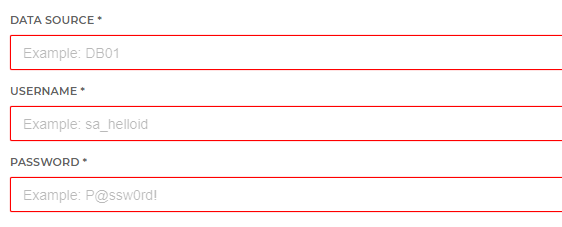

# HelloID-Conn-Prov-Source-Raet-Oracle-Query
HelloID provisioning source connector for Raet On-Premises based on Oracle DB queries.
Please remember This is the first version of this connector. Any feedback will be appreciated!

<!-- TABLE OF CONTENTS -->
## Table of Contents
* [Introduction](#introduction)
* [Getting Started](#getting-started)
  * [Source](#source)
  * [Target](#target)
  * [Mappings](#mappings)
  * [Scope](#scope)
* [Setup the PowerShell connector](#setup-the-powershell-connector)

## Introduction
The interface to communicate with Beaufort On-Premises is through a set of Oracle or SQL DB queries.

For this connector we use the Oracle database and queries.

<!-- GETTING STARTED -->
## Getting Started

By using this connector you will have the ability to retrieve employee and contract data from the HR Core Pulic On-Premises (previously known as Beaufort) HR system.

Connecting to Profit is done using the full Oracle DB client. 
Please see the following page from the Oracle Docs for more information.

[Oracle Database Client Installation Guide](https://docs.oracle.com/cd/E11882_01/install.112/e47959/install.htm#NTCLI1280)

### Mappings
A basic person and contract mapping is provided. Make sure to further customize these accordingly.

### Scope

The data collection retrieved by the queries is a default set which is sufficient for HelloID to provision persons.
The queries can be changed by the customer itself to meet their requirements.

<!-- USAGE EXAMPLES -->
## Setup the PowerShell connector

1. Add a new 'Source System' to HelloID and make sure to import all the necessary files.

    - [ ] configuration.json
    - [ ] mapping.json
    - [ ] persons.ps1
    - [ ] departments.ps1

2. Fill in the required fields on the 'Configuration' tab.

_For more information about our HelloID PowerShell connectors, please refer to our general [Documentation](https://docs.helloid.com/hc/en-us/articles/360012557600-Configure-a-custom-PowerShell-source-system) page_